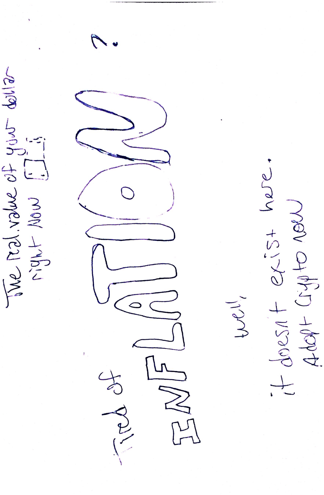

I plan for my visual argument to be about **cryptocurrency adoption**. We live in a time of financial insecurity, unprecedented inflation, and our government continues to help the banks not the people in times of financial crisis. I want to convince people to at least try to venture into the world of crypto, since its implications for modern society are absolutely astonishing and necessary. Venezuela was one of the top nations to rapidly adopt crypto in 2021 and for good reason. Sound and secure money is a human right. I want to help bridge the gap between this and the general public. 

I have a few ideas for my visual argument and gathered a few assets that I will most likely use along with creating a general idea sketch. My visual argument will present the reminder of inflation in this country with a simple graphic and one sentence, and it will also present one of the fundamentals of cryptocurrencies, it cannot be tampered with or corrupted. No centralized entity controls the value of your money and you actually own your money, as opposed to the bank actually owning your money. This means inflation doesn't exist unless purposefully from the beginning. I want to this part of the visual argument to dominate the page with size/scale and maybe color as well. I really want to use positive and negative space in a meaningful way as well, but am still thinking how to go about it.  

I picked out a few assets already from the Noun Project and placed them in an Assets folder here in the repo.

<!-- 

 -->

|Assets|Sources|
|-------|--------|
|Crypto coin|CC license|
|Inflation text| Me|
|Dollar graphic|CC license|
|Inflation graph| CC license|